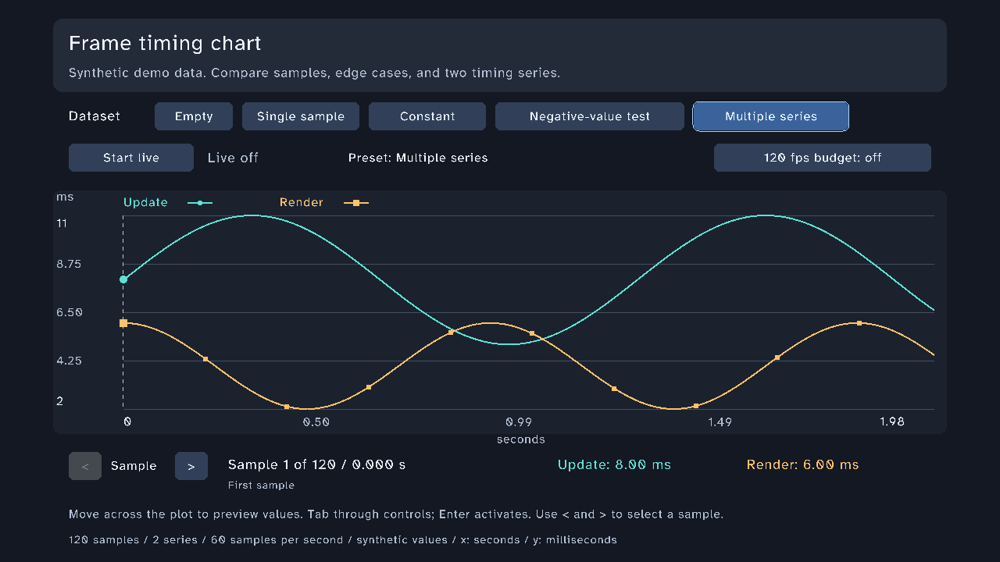
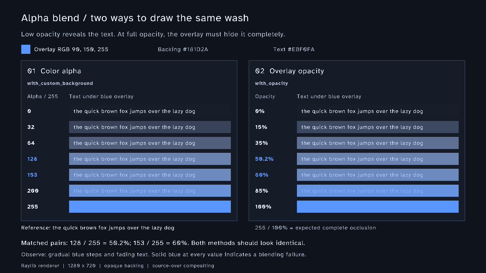

# Applying the supplied design guidance to WM

Reviewed September 13, 2026. This review uses the supplied Dannaway guidance recorded
in `todo.md` and the current WM source and screenshot baselines. The external page
loader refused both supplied URLs because of this session's input filtering policy.
The supported Meta CLI fallback exposed no public-page reader. No claim below relies
on inspecting an unavailable article image or repository file.

## Decisions for ordinary WM interfaces

| Supplied guidance | WM decision | Existing visual example and review check |
|---|---|---|
| Group related content with space | Use 8px within a compact group and at least 16px between groups at the 720p design size. Keep intentional game-specific compositions. | `chart_lab` groups dataset controls, live controls, plot and selected values. Blur the screenshot and check those groups remain distinct. |
| Make hierarchy and the main action clear | Use one filled primary action per task. Give secondary actions less emphasis. Avoid styling passive status text as a button. | `dialog_danger` pairs an explicit destructive verb with Cancel. Check which action attracts attention first and where keyboard focus starts. |
| Use a consistent, readable type family | Ordinary UI uses the registered AtkinsonMock regular/bold pair. Keep long descriptions left aligned. Reserve uppercase and oversized type for short deliberate headings. | `chart_lab` uses one family for title, labels and numeric values. `styled_text_lab` is the deliberate exception for inline emphasis. |
| Improve line spacing | Evaluate 1.5–2 times body size for longer prose against actual available space. Do not prescribe that range to single-line controls. | `multiline_text_lab` is the relevant specimen. Consistent styled-label line spacing remains an afterhours gap. |
| Remove decoration that does not explain anything | Use a border to distinguish an input or focus state. Use color for a named state or action. Keep ornamental frames in the screens demonstrating them. | Compare `decorative_frame` with ordinary `forms`; their purposes differ. Do not copy the frame treatment into every control. |
| Contrast and cues beyond color | Target 4.5:1 for ordinary text and 3:1 for qualifying large text. Essential control boundaries and state indicators need 3:1 against adjacent colors where WCAG requires it. Pair status color with a label or shape. | `chart_lab` distinguishes series with circles/squares and names. `alpha_blend_repro` exposes backing, foreground and alpha explicitly. Measure the composited color, not just the source RGBA. |
| Judge dark-gray text in context | Pick foreground by measured contrast with its actual backing. Do not mechanically replace bright text with dark gray on a dark theme. | White text on the chart's dark panels is intentional. Transparent controls must pass over every supported backing. |

WCAG exceptions and scope matter. Inactive controls have contrast exceptions, but
WM should still make their labels legible. A 44px target is a useful project goal,
not a universal WCAG AA requirement. Size and spacing requirements depend on the
applicable WCAG version and exceptions. These checks are not a conformance claim.

## Choices from the supplied design-system examples

| Example in supplied material | Adopt for WM | Keep out of this change |
|---|---|---|
| Carbon surface colors and larger patterns | Distinguish page, panel and overlay with a small set of theme roles. Review a complete dialog or settings task as well as isolated buttons. | Importing Carbon's palette or adding a new theme-token API without a consumer need. |
| Atlassian semantic colors and elevation | Name color by purpose, such as selected, destructive or muted. Use the same role consistently through default, hover and focus states. | Copying web elevation values into a renderer whose shadows and clipping behave differently. |
| Spectrum input-dependent sizing and writing | Choose roomier controls for gamepad/touch use; keep action labels short and explicit. Review the actual hit rectangle. | Guessing hardware capability from an idle pointer or silently adding an automatic density system. |
| GOV.UK tested accessible patterns | Reuse predictable labels, visible focus, errors with a recovery action, and explicit destructive confirmations. Test completion by keyboard. | Claiming a WM screen inherits accessibility certification by resembling a GOV.UK pattern. |

The existing theme and component configuration APIs can demonstrate these choices.
No new afterhours API follows from this review alone.

## Visual examples

These are existing checked-in renders, not new captures or proof of today's runtime.
Root verification should use fresh screenshots before closing a screen task.

Use the chart as the ordinary-interface reference. Keep the alpha specimen as a
measurement aid; copying its technical labels into product screens would add noise.

## Source coverage

- Supplied "16 little UI design tips that make a big impact", summarized in `todo.md`.
- Supplied [design system examples](https://www.adhamdannaway.com/blog/design-systems/design-system-examples), summarized in `todo.md`. This session did not independently load the article.
- WM `src/systems/screens/ChartLab.h`, `AlphaBlendRepro.h`, existing baselines and `docs/STYLE_GUIDE.md`.
- [chrstph-gg/sf-windows](https://github.com/chrstph-gg/sf-windows) could not be inspected. Its behavior, dependencies, licensing, platform support and maintenance status remain unverified. Do not adopt it or close the repository-review TODO on the strength of its name. A later review should identify the actual implementation and one useful interaction, then compare that interaction with WM's existing window, focus and input behavior.
